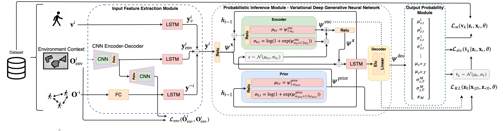

# Social-VRNN: One-Shot Multi-modal Trajectory Prediction for Interacting Pedestrians



This is the code associated with the following publications:

**Conference Version:** "Social-VDGNN: One-Shot Multi-modal Trajectory Prediction for Interacting Pedestrians", submitted to. [Link to Paper](-), [Link to Video](https://www.youtube.com/watch?v=XHoXkWLhwYQ)

This repo also contains the scripts to train and evaluate quantitatively and qualitatively the proposed network architecture.

---

### Setup

This set of instructions were only tested for Ubuntu16 with Tensorflow 1.15.
* Please follow the following instructions:
```
./install.sh
./download_data
source social_vdgnn/bin/activate
cd src/
./train.sh
./test.sh
```
The train.sh script has several examples how to train the proposed model for different datasets and considering different hyperparameters. After the model is trained, the test.sh script evaluates the quatitative and qualitative performance of the trained models. Each model has a name and an id which identifies it.

You can find on the trained_models folder, all the trained models and inside each model the qualitative results in a video format. The qualitative results are saved inside the src folder on a csv file with the model name, e.g. <Model name>.csv.  
### Model
Our model ...


### If you find this code useful, please consider citing:

```
@inproceedings{,
  author = {},
  booktitle = {Conference on Robot Learning},
  date-modified = {2020-07-18 06:18:08 -0400},
  month = July,
  title = {Social-VRNN: One-Shot Multi-modal Trajectory Prediction for Interacting Pedestrians},
  year = {2020},
  url = {-},
  bdsk-url-1 = {-}
}
```