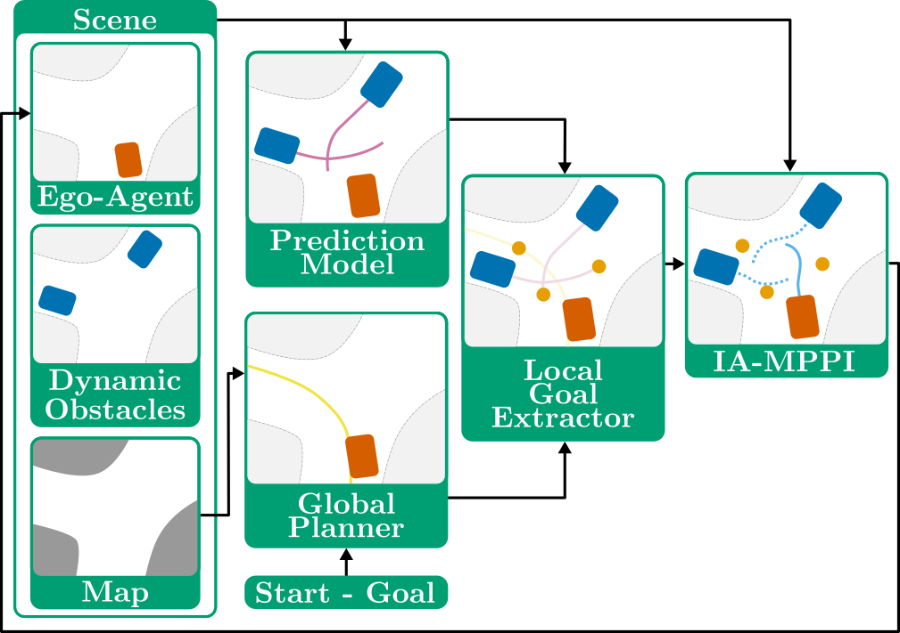

# Interaction-Aware Sampling-Based MPC with Learned Local Goal Predictions



This repository contains the training and testing scripts for the prediction model used in the "Interaction-Aware Sampling-Based MPC with Learned Local Goal Predictions" paper.

### Data

To download the data and trained models (prediction model and pre-trained autoencoder), run
```
./download_data.sh
``` 

### Setup

This repository requires python <= 3.7 and tensorflow == 1.15.x. The instructions were tested on Ubuntu 16.

```
./install.sh
source social_vdgnn/bin/activate
```

### Training 

The training script for the model is src/train_roboat.py. In order to train a new model on the data, specify a model number (--exp_num) and the training parameters in /src/train.sh. An example is provided in the file. Then in /src, run 
```
./train.sh
```

### Testing

In a similar fashion, specify training parameters for the trained model in /src/test.sh (examples provided) and run
```
./test.sh
```

Model parameters will be automatically saved in /trained_models
 

### If you find this code useful, please consider citing:

```
@inproceedings{jansma2023,
  author={Jansma, Walter and Trevisan, Elia and Serra-Gómez, {\'A}lvaro and Alonso-Mora, Javier},
  booktitle={2023 International Symposium on Multi-Robot and Multi-Agent Systems (MRS)}, 
  title={Interaction-Aware Sampling-Based MPC with Learned Local Goal Predictions},
  year={2023},
}
```

This code and the model are base on "Social-VRNN: One-Shot Multi-modal Trajectory Prediction for Interacting Pedestrians" by de Brito et al. You can find their code [here](https://github.com/tud-amr/social_vrnn) and their paper [here](https://proceedings.mlr.press/v155/brito21a.html). If relevant, please consider citing them too.
